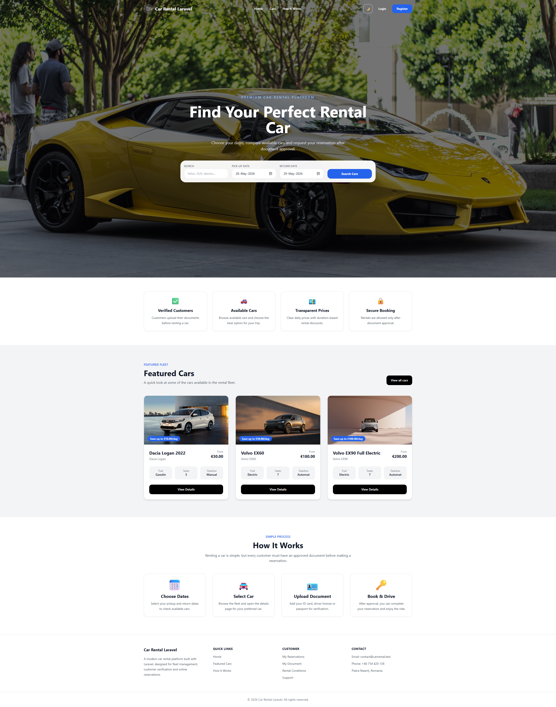
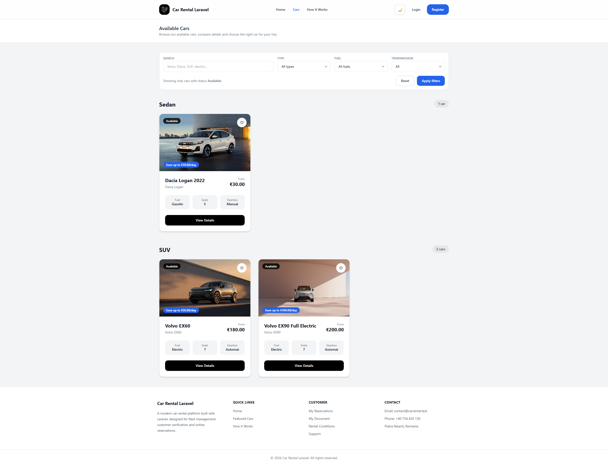
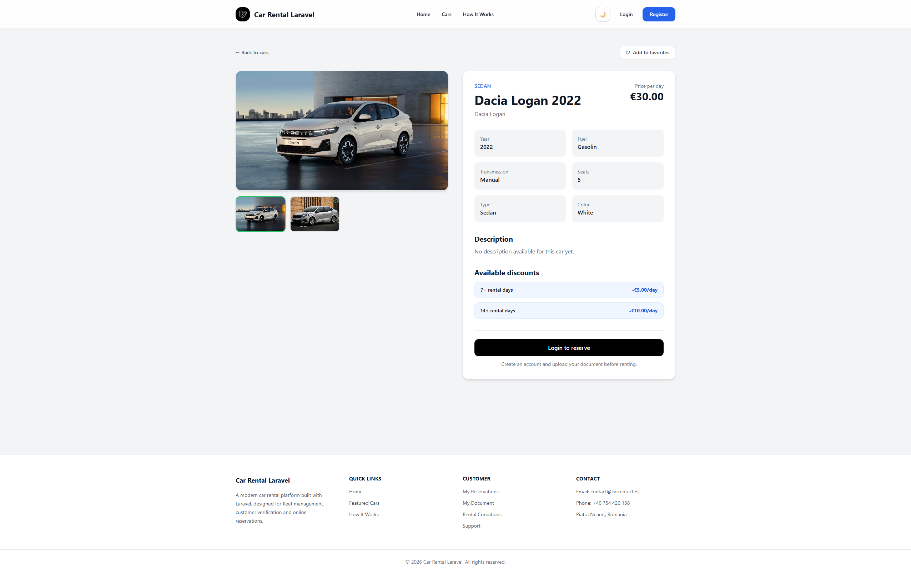
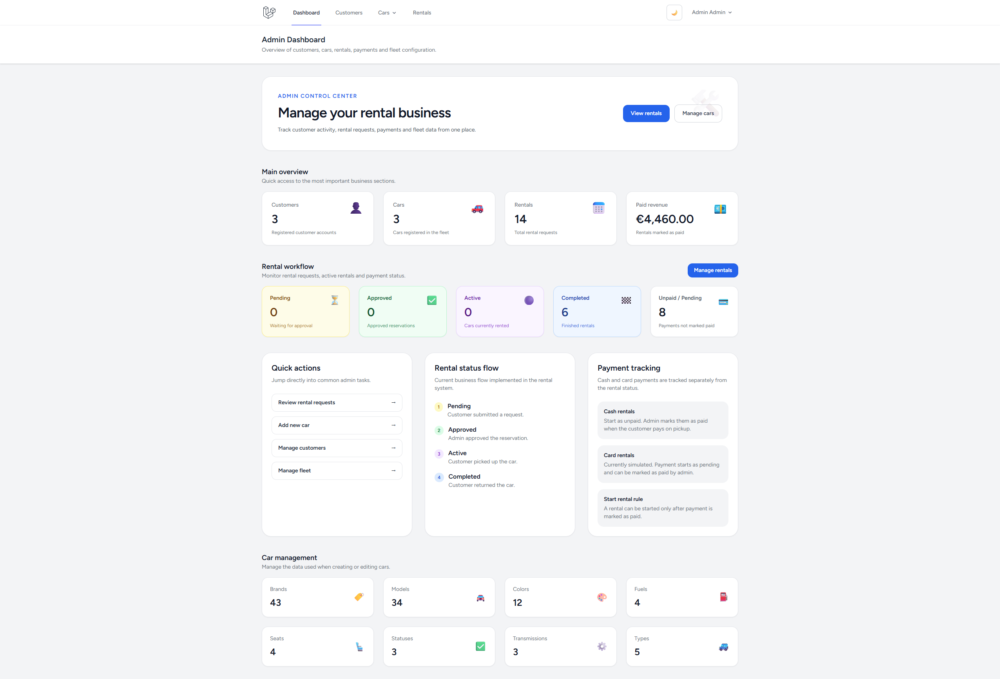
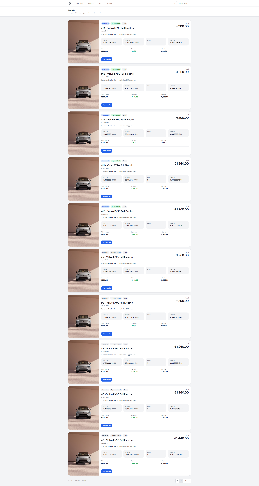
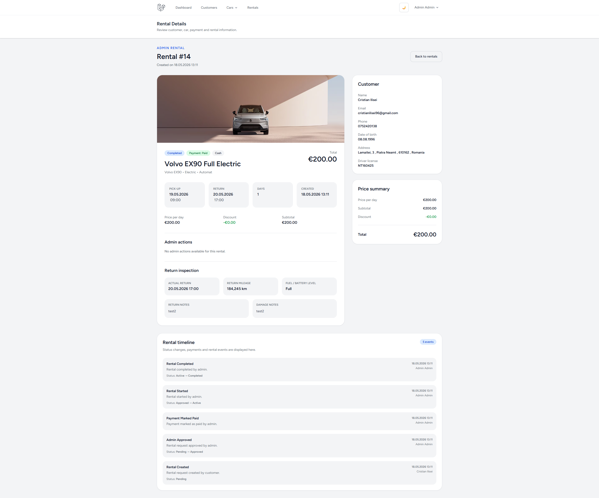
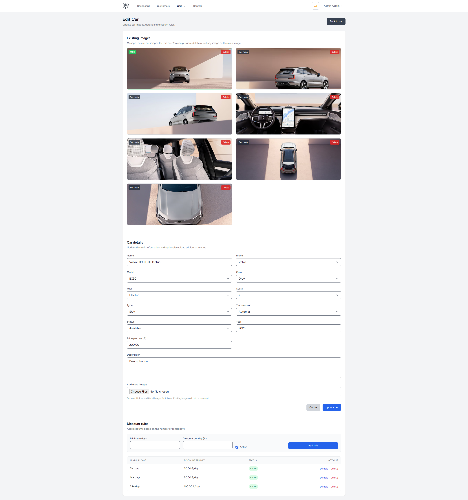
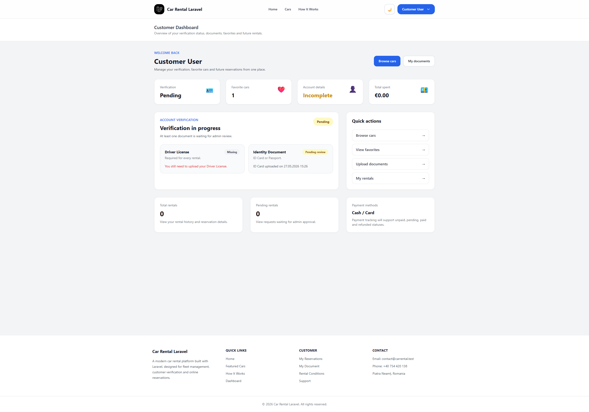
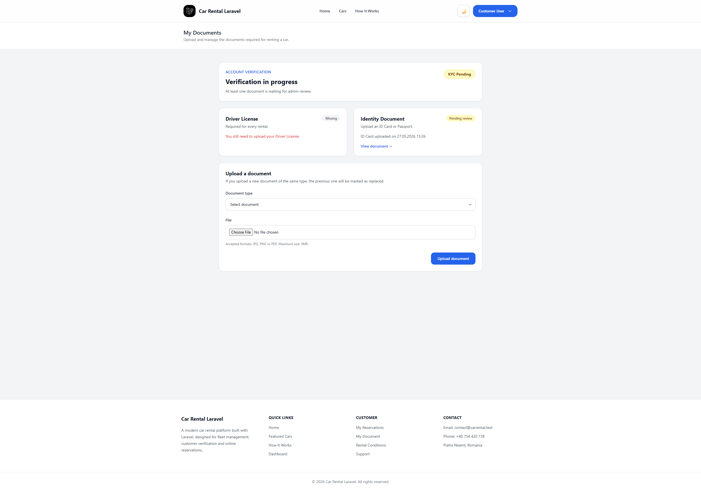

# 🚗 Car Rental Laravel

A full-featured car rental web application built with **Laravel**, **MySQL**, and **Blade**. Supports customer verification (KYC), fleet management, online reservations, discount rules, and a complete admin panel.

---

## 📸 Screenshots

### 🌐 Public


*Landing page with date-based search and featured cars*


*Cars listing with filters by type, fuel and transmission*


*Car detail page with images, specs and pricing*

### 🛠️ Admin Panel


*Admin dashboard — customers, cars, rentals and revenue overview*


*Rental list with status, payment and date info*


*Rental detail with customer info, price summary and full event timeline*


*Car editor — multiple images, specs and day-based discount rules*

### 👤 Customer Panel


*Customer dashboard — verification status, favorites and rental history*


*Document upload — Driver License and ID Card/Passport for account verification*

---

## ✨ Features

### 🌐 Public
- Landing page with date-based car availability search
- Cars listing grouped by type (Sedan, SUV, etc.) with filters (fuel, transmission, type)
- Car detail page with multiple images and pricing info
- Dark / Light mode toggle

### 👤 Customer
- Register & login with email
- KYC verification — upload **Driver License** and **ID Card or Passport**
- Reservations only allowed after document approval
- Customer dashboard: verification status, favorite cars, total spent, pending rentals
- In-rental messaging with admin
- View full rental timeline (created → approved → active → completed)

### 🛠️ Admin
- Admin dashboard with overview: customers, cars, rentals, paid revenue
- **Rental workflow**: Pending → Approved → Active → Completed
- **Payment tracking**: Cash and Card managed separately; admin marks payments as paid
- Customer management & document review (approve/reject KYC)
- Full fleet CRUD: add/edit/delete cars with multiple images, set main image
- Car attributes management: 43 brands, 34 models, colors, fuels, seats, transmissions, types, statuses
- **Discount rules per car**: configurable day-based discounts (e.g. 7+ days = -€20/day), enable/disable per rule
- Rental details with complete event timeline

---

## 🛠 Tech Stack

| Layer | Technology |
|---|---|
| Backend | PHP 8+, Laravel 11 |
| Frontend | Blade, Tailwind CSS |
| Database | MySQL |
| Auth | Laravel Breeze / built-in Auth |
| File Storage | Laravel Storage (local) |

---

## ⚙️ Installation

### Requirements
- PHP >= 8.1
- Composer
- MySQL
- Node.js & NPM

### Steps

```bash
# 1. Clone the repository
git clone https://github.com/cristianilisei96/car-rental-laravel.git
cd car-rental-laravel

# 2. Install PHP dependencies
composer install

# 3. Install Node dependencies & build assets
npm install && npm run build

# 4. Copy environment file and configure it
cp .env.example .env

# 5. Generate application key
php artisan key:generate

# 6. Configure your database in .env
# DB_DATABASE=car_rental
# DB_USERNAME=root
# DB_PASSWORD=

# 7. Run migrations and seed the database
php artisan migrate --seed

# 8. Create storage symlink
php artisan storage:link

# 9. Start the development server
php artisan serve
```

Then visit: [http://localhost:8000](http://localhost:8000)

---

## 🔐 Default Credentials (after seeding)

| Role | Email | Password |
|---|---|---|
| Admin | admin@admin.com | password |
| Customer | customer@example.com | password |

> ⚠️ Change these credentials before deploying to production.

---

## 📁 Project Structure (key parts)

```
app/
├── Http/Controllers/
│   ├── Admin/          # Admin controllers (cars, rentals, customers)
│   └── Customer/       # Customer controllers (reservations, documents)
├── Models/             # Car, Rental, Document, User, DiscountRule...
resources/
├── views/
│   ├── admin/          # Admin panel Blade views
│   ├── customer/       # Customer panel Blade views
│   └── public/         # Public landing, cars listing
database/
├── migrations/
└── seeders/
```

---

## 🔄 Rental Flow

```
Customer registers
    → uploads Driver License + ID/Passport
        → Admin approves documents (KYC)
            → Customer searches & picks a car
                → Submits reservation request
                    → Admin reviews & approves
                        → Customer picks up car (Active)
                            → Customer returns car (Completed)
                                → Admin marks payment as Paid
```

---

## 💰 Discount Rules

Each car can have custom discount rules based on rental duration:

| Minimum Days | Discount per Day |
|---|---|
| 7+ days | -€20.00 |
| 14+ days | -€50.00 |
| 28+ days | -€100.00 |

Rules can be individually enabled or disabled from the admin panel.

---

## 📄 License

This project is open-source and available under the [MIT License](LICENSE).

---

## 👤 Author

**Cristian Ilisei**
- GitHub: [@cristianilisei96](https://github.com/cristianilisei96)
- LinkedIn: [linkedin.com/in/cristianilisei96](https://linkedin.com/in/cristianilisei96)
- Email: cristianilisei96@gmail.com
- Location: Piatra Neamț, Romania
